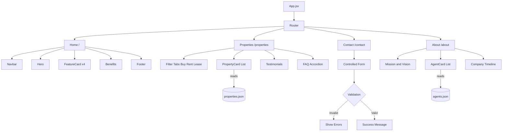

# 🏡 HomeNest — Real Estate Listing Platform

<p align="center">
  
  
  
  
  
</p>

<p align="center">
  A frontend prototype for a real estate agency — built to showcase property listings and convert visitors into leads.
</p>

---

## 📑 Table of Contents

- [Overview](#-overview)
- [Tech Stack](#-tech-stack)
- [Architecture](#-architecture)
- [Pages & Features](#-pages--features)
- [Folder Structure](#-folder-structure)
- [Getting Started](#-getting-started)
- [Team](#-team)
- [Notes](#-notes)

---

## 📖 Overview

HomeNest is built as a **component-driven React application** simulating a real estate agency's public-facing website. It focuses on clean architecture, reusable UI components, controlled forms, and client-side state management — with no backend dependency (form submissions are simulated via conditional rendering).

---

## 🛠 Tech Stack

| Layer | Technology |
|---|---|
| Framework | React (Functional Components + Hooks) |
| Routing | React Router DOM |
| Styling | Tailwind CSS |
| State Management | `useState` / `useEffect` |
| Data Layer | Static JSON (`/data`) |
| Version Control | Git & GitHub |

---

## 🏗 Architecture



> Data flows one-way: JSON files in `/data` → parent page components → child components via props.

---

## 📄 Pages & Features

### 🏠 Home (`/`)
- Navbar with active-link styling
- Hero section with headline & CTA
- 4+ feature highlights (Verified Listings, Home Loans, Virtual Tours, Legal Assistance)
- Benefits section
- Footer with contact & social info

### 🏘️ Properties (`/properties`)
- Property listings rendered dynamically from JSON
- Filter tabs — Buy / Rent / Lease
- Client testimonials
- FAQ accordion (`useState`-driven toggle)

### ✉️ Contact (`/contact`)
- Fully controlled enquiry form: Name, Email, Phone, Visit Date, Property Type (dropdown), Purpose (radio), Amenities (checkboxes), Message
- JS-based validation — no HTML5-only validation
- Conditional error messages per field
- Success message shown on valid submission (simulated, no backend)

### 👥 About (`/about`)
- Mission & vision
- Agent profiles via `AgentCard` (photo, name, role, bio)
- Company story timeline

---

## 📁 Folder Structure

```
homenest/
├── public/
├── src/
│   ├── components/
│   │   ├── Navbar.jsx
│   │   ├── Footer.jsx
│   │   ├── Hero.jsx
│   │   ├── FeatureCard.jsx
│   │   ├── PropertyCard.jsx
│   │   ├── AgentCard.jsx
│   │   ├── FilterTabs.jsx
│   │   ├── FAQAccordion.jsx
│   │   └── Testimonials.jsx
│   ├── pages/
│   │   ├── Home.jsx
│   │   ├── Properties.jsx
│   │   ├── Contact.jsx
│   │   └── About.jsx
│   ├── data/
│   │   ├── properties.json
│   │   ├── agents.json
│   │   └── testimonials.json
│   ├── App.jsx
│   └── main.jsx
├── package.json
└── README.md
```

---

## 🚀 Getting Started

**1. Clone the repository**
```bash
git clone https://github.com/shortsays/HomeNest---The-Tech-Titans.git
cd HomeNest---The-Tech-Titans
```

**2. Install dependencies**
```bash
npm install
```

**3. Run the development server**
```bash
npm run dev
```

App runs at `http://localhost:5173` by default.

---

## 👨‍💻 Team — The Tech Titans

| Module | Owner |
|---|---|
| Home Page & Routing Setup | — |
| Properties Page, Filtering & Data Layer | Anisha |
| Contact Form & Validation | — |
| About Page & FAQ | — |
| Styling, Responsiveness & Deployment | — |

---

## 📌 Notes

- No backend — form submissions are handled via conditional UI rendering only.
- Fully responsive across mobile, tablet, and desktop (Flexbox/Grid + media queries).
- Built with clean, incremental, feature-based commits.
