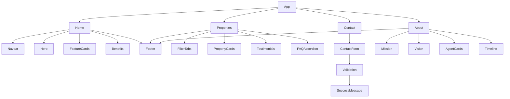

# 🏡 HomeNest — Real Estate Listing Platform

<p align="center">
  
  
  
  
  
</p>

<p align="center">
  A modern React-based Real Estate Listing Platform designed to showcase verified properties, generate customer leads, and provide a seamless browsing experience.
</p>

---

# 📑 Table of Contents

- Overview
- Features
- Tech Stack
- Project Architecture
- Pages
- Folder Structure
- Installation
- Available Scripts
- Responsive Design
- Team
- Future Improvements
- License

---

# 📖 Overview

HomeNest is a **React frontend prototype** developed for a real estate agency. The project follows a **component-based architecture**, uses **React Router DOM** for navigation, **useState** for state management, and **JSON files** for dynamic rendering of property listings, agents, and testimonials.

The application demonstrates reusable components, controlled forms, client-side validation, and responsive design principles.

---

# ✨ Features

## 🏠 Home Page

- Responsive Navbar
- Hero Section
- Browse Properties CTA
- Feature Cards
- Benefits Section
- Footer

---

## 🏘️ Properties Page

- Dynamic Property Listings
- Property Cards
- Buy / Rent / Lease Filter
- Testimonials
- FAQ Accordion
- Responsive Grid Layout

---

## ✉️ Contact Page

- Controlled React Form
- JavaScript Validation
- Dropdown
- Radio Buttons
- Checkboxes
- Textarea
- Submit & Reset Buttons
- Success Message using Conditional Rendering

---

## 👥 About Page

- Company Introduction
- Mission & Vision
- Agent Cards
- Company Timeline

---

# 🛠 Tech Stack

| Technology | Purpose |
|------------|---------|
| React | Frontend Framework |
| React Router DOM | Routing |
| JavaScript (ES6+) | Application Logic |
| CSS3 | Styling |
| React Hooks | State Management |
| JSON | Static Data |
| Git & GitHub | Version Control |

---

# 🏗 Project Architecture



---

# 📄 Pages

## 🏠 Home (/)

### Components

- Navbar
- Hero
- FeatureCard
- Benefits Section
- Footer

### Features

- Active Navigation
- Hero Banner
- Browse Properties Button
- Four Feature Cards rendered using `.map()`
- Responsive Layout

---

## 🏘️ Properties (/properties)

### Components

- Navbar
- FilterTabs
- PropertyCard
- Testimonials
- FAQAccordion
- Footer

### Features

- Dynamic Property Cards
- JSON Data Rendering
- Buy Filter
- Rent Filter
- Lease Filter
- Testimonials
- FAQ Accordion using useState

---

## ✉️ Contact (/contact)

### Components

- Navbar
- Contact Form
- Footer

### Features

- Controlled Components
- Form Validation
- Error Messages
- Success Message
- Reset Button

---

## 👥 About (/about)

### Components

- Navbar
- Mission Section
- Vision Section
- AgentCard
- Timeline
- Footer

### Features

- Dynamic Team Cards
- Company History
- Responsive Layout

---

# 📂 Folder Structure

```text
homenest/
├── public/
│
├── src/
│   ├── components/
│   │   ├── Navbar.jsx
│   │   ├── Navbar.css
│   │   ├── Footer.jsx
│   │   ├── Footer.css
│   │   ├── Hero.jsx
│   │   ├── Hero.css
│   │   ├── FeatureCard.jsx
│   │   ├── FeatureCard.css
│   │   ├── PropertyCard.jsx
│   │   ├── PropertyCard.css
│   │   ├── AgentCard.jsx
│   │   ├── AgentCard.css
│   │   ├── FilterTabs.jsx
│   │   ├── FilterTabs.css
│   │   ├── FAQAccordion.jsx
│   │   ├── FAQAccordion.css
│   │   ├── Testimonials.jsx
│   │   └── Testimonials.css
│   │
│   ├── pages/
│   │   ├── Home.jsx
│   │   ├── Home.css
│   │   ├── Properties.jsx
│   │   ├── Contact.jsx
│   │   ├── Contact.css
│   │   ├── About.jsx
│   │   └── About.css
│   │
│   ├── data/
│   │   ├── properties.json
│   │   ├── agents.json
│   │   └── testimonials.json
│   │
│   ├── App.jsx
│   ├── App.css
│   ├── index.css
│   └── main.jsx
│
├── .gitignore
├── package.json
├── package-lock.json
├── vite.config.js
└── README.md
```

---

# 🔄 Data Flow

```
properties.json
        │
        ▼
Properties.jsx
        │
        ▼
PropertyCard.jsx

----------------------------

agents.json
      │
      ▼
About.jsx
      │
      ▼
AgentCard.jsx

----------------------------

testimonials.json
         │
         ▼
Testimonials.jsx
```

---

# ⚙️ Installation

Clone the repository

```bash
git clone https://github.com/shortsays/HomeNest---The-Tech-Titans.git
```

Move inside the project

```bash
cd HomeNest---The-Tech-Titans
```

Install dependencies

```bash
npm install
```

Start development server

```bash
npm run dev
```

Open

```
http://localhost:5173
```

---

# 📜 Available Scripts

Install Packages

```bash
npm install
```

Run Development Server

```bash
npm run dev
```

Build Project

```bash
npm run build
```

Preview Production Build

```bash
npm run preview
```

---

# 📱 Responsive Design

The application is fully responsive using

- Flexbox
- CSS Grid
- Media Queries

Supported Devices

- Desktop
- Laptop
- Tablet
- Mobile

---

# ⚛ React Concepts Used

- Functional Components
- React Router DOM
- useState
- Props
- Conditional Rendering
- Event Handling
- Controlled Components
- Array Mapping
- Component Reusability

---

# 📊 Assignment Requirements Covered

| Requirement | Status |
|------------|--------|
| React Functional Components | ✅ |
| React Router DOM | ✅ |
| Navbar | ✅ |
| Hero | ✅ |
| Feature Cards | ✅ |
| Footer | ✅ |
| Property Cards | ✅ |
| JSON Data | ✅ |
| Props | ✅ |
| Filter Tabs | ✅ |
| Testimonials | ✅ |
| FAQ Accordion | ✅ |
| useState | ✅ |
| Contact Form | ✅ |
| JS Validation | ✅ |
| Success Message | ✅ |
| Agent Cards | ✅ |
| Timeline | ✅ |
| Responsive Design | ✅ |

---

# 👨‍💻 Team

## The Tech Titans

| Module | Team Member |
|---------|-------------|
| **Team Leader & Home Page** | **Ankit Saraswat** |
| **Properties Page** | **Anisha Ranjan** |
| **Contact Page** | **Vrinda** |
| **About Page** | **Aditya** |
| **Project Presentation** | **Ajay** |

### Team Responsibilities

- **Ankit Saraswat (Team Leader)** – Led the project, designed and developed the Home Page, set up the React project structure, configured routing, integrated components, managed Git/GitHub workflow, and coordinated the overall development process.
- **Anisha Ranjan** – Developed the Properties Page, including dynamic property listings, filter tabs, testimonials, and FAQ accordion.
- **Vrinda** – Built the Contact Page with a fully controlled React form, JavaScript validation, conditional rendering, and responsive design.
- **Aditya** – Developed the About Page, including the Mission & Vision section, Agent Cards, and Company Timeline.
- **Ajay** – Prepared and delivered the project presentation, documenting the application's features, architecture, workflow, and demonstrating the project during evaluation.

---

# 🚀 Future Improvements

- Backend Integration
- User Authentication
- Property Search
- Wishlist
- Google Maps Integration
- Property Details Page
- Admin Dashboard
- Dark Mode
- Image Gallery
- Live Chat Support

---

# 📄 License

This project is developed for academic purposes as part of a React Frontend assignment.

---

<p align="center">
Made with ❤️ using React by <strong>The Tech Titans</strong>
</p>